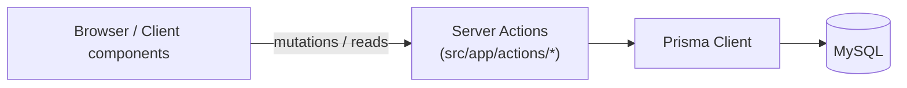
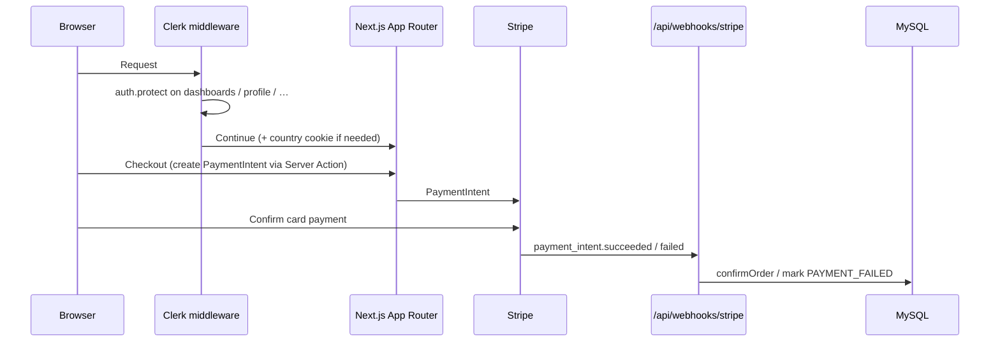

# Salamo

**A multi-vendor marketplace** where independent sellers run their own stores, buyers shop across the catalog, and platform admins govern stores, catalog, and orders.

> **Name options (pick one for the repo / About):**
> 1. **Salamo** — already used in-app (profile copy, seed banners)
> 2. **Vendora** — emphasizes multi-vendor selling
> 3. **Bazaario** — marketplace / bazaar framing

[](https://github.com/atmezasallam/ecommerce/actions/workflows/ci.yml)
[](./LICENSE)
[](https://nextjs.org/)
[](https://www.typescriptlang.org/)
[](https://bun.sh/)

---

## Live Demo

| | |
|---|---|
| **URL** | _Deploy to Vercel, then paste the URL here_ — `https://YOUR-APP.vercel.app` |
| **Demo buyer** | _Create a Clerk test user and paste email / password here_ |
| **Demo seller** | _Seller account that owns an `ACTIVE` store (paste credentials)_ |
| **Demo admin** | _Account whose email is listed in `ADMIN_EMAILS` (paste credentials)_ |
| **Stripe test card** | `4242 4242 4242 4242` · any future expiry · any CVC · any ZIP |

Local Stripe webhooks (optional): `stripe listen --forward-to localhost:3000/api/webhooks/stripe`

---

## Screenshots

Place captures under [`docs/screenshots/`](./docs/screenshots/). Suggested filenames:

| File | Screen to capture |
|------|-------------------|
| `01-storefront-homepage.png` | `/` — hero banners, categories, top-rated / featured / new arrivals |
| `02-product-variant.png` | `/product/[productSlug]/[variantSlug]?size=…` — variant switcher, sizes, add to cart / wishlist |
| `03-cart.png` | `/cart` — multi-store cart lines and order summary |
| `04-seller-dashboard.png` | `/dashboard/seller/stores/[storeUrl]` — seller store overview |
| `05-seller-orders.png` | `/dashboard/seller/stores/[storeUrl]/orders` — per-item fulfillment |
| `06-messaging.png` | `/profile/messages` or `/dashboard/seller/messages` — buyer↔seller thread |
| `07-admin-dashboard.png` | `/dashboard/admin` — platform metrics, pending stores, recent orders |

```markdown


```

---

## Features

Derived from real App Router pages and server actions — not aspirational.

### Storefront

- Homepage with announcement bar, hero / promotional banners, category strip, top-rated, featured, and new-arrival sections (`/`)
- Product browse with search, category, subcategory, offer tags, sort, and pagination (`/browse`)
- Product detail with **variant + size** selection, specs, Q&A, reviews, related products, and seller store card (`/product/[productSlug]/[variantSlug]`)
- Cart with multi-store line items and merge-on-login (`/cart`, `POST /api/cart/merge`)
- Checkout + success flow with Stripe Payment Element (`/checkout`, `/checkout/success`)
- Wishlist (profile + guest merge) and public wishlist share (`/profile/wishlist`, `/wishlist/share/[userId]`)
- Country cookie for shipping defaults (`/api/setUserCountryInCookies`)
- Help center and policy pages (`/help-center/*`, `/refund-policy`, `/legal-privacy`, …)

### Seller Dashboard

Scoped by **`storeUrl`** under `/dashboard/seller/stores/[storeUrl]/…`:

- Apply / create a store (`/become-a-seller`, `/dashboard/seller/stores/new`)
- Store switcher across a seller’s stores
- Products + variants CRUD (`…/products`, `…/products/new`, `…/variants/…`)
- Inventory stock overview (`…/inventory`)
- Orders with item-level fulfillment status / tracking (`…/orders`)
- Store coupons (`…/coupons`)
- Default shipping + per-country rates (`…/shipping`)
- Store settings (`…/settings`)
- Seller inbox (`/dashboard/seller/messages`)

### Admin Dashboard

- Platform overview: users, stores, products, pending approvals (`/dashboard/admin`)
- Store moderation (`/dashboard/admin/stores`, `/dashboard/admin/stores/[storeId]`)
- Cross-store orders (`/dashboard/admin/orders`)
- Catalog: categories, subcategories, offer tags (`…/categories`, `…/subCategories`, `…/offer-tags`)
- Platform coupons, banners, homepage brands (`…/coupons`, `…/banners`, `…/homepage-brands`)

### Payments

- Stripe PaymentIntents + `@stripe/react-stripe-js` checkout UI
- Webhook confirms / fails orders (`POST /api/webhooks/stripe` → `payment_intent.succeeded` / `payment_intent.payment_failed`)
- Server-side totals; client monetary fields rejected (`assertNoClientMonetaryFields`)

### Auth

- Clerk sign-in / sign-up (`/sign-in`, `/sign-up`)
- Middleware protects dashboards, profile, seller onboarding, and several account pages
- Clerk webhook syncs users; `ADMIN_EMAILS` can promote admins on `user.created` (`POST /api/webhooks`)
- Roles: `USER` | `SELLER` | `ADMIN` (Prisma `Role`)

### Messaging

- Buyer↔store conversations (optional product context)
- Buyer UI: `/profile/messages`
- Seller UI: `/dashboard/seller/messages`
- Unread counts + server actions in `message.actions.ts`

---

## Tech Stack

| Technology | Version | Why |
|---|---|---|
| [Next.js](https://nextjs.org/) (App Router) | 14.2.33 | SSR/RSC storefront + dashboards, Server Actions, route groups |
| React | 18.3.1 | UI for storefront and dashboards |
| TypeScript | 5.9.3 | Typed domain models and safer server/client boundaries |
| [Bun](https://bun.sh/) | 1.x | Fast install/runtime; lockfile + CI use `bun` |
| Prisma | 5.19.1 | Typed ORM over MySQL marketplace schema |
| MySQL | via `DATABASE_URL` | Datasource in `prisma/schema.prisma` |
| [Clerk](https://clerk.com/) | `@clerk/nextjs` 6.35 | Auth UI, middleware, webhooks |
| [Stripe](https://stripe.com/) | `stripe` 22.x + React Stripe.js | PaymentIntents + webhook fulfillment |
| Cloudinary | `next-cloudinary` 6.17 | Product / banner / store image uploads |
| Tailwind CSS | 4.1 | Utility styling + shadcn/ui primitives |
| Vitest | 3.2 | Unit / component tests in CI |
| Playwright | 1.62 | Optional e2e (`bun run test:e2e`) |

---

## Architecture

### Multi-tenancy (`storeUrl`)

Each seller **Store** has a unique `url` slug. Seller dashboard routes are nested under:

`/dashboard/seller/stores/[storeUrl]/…`

Server code loads the store with `{ url: storeUrl, userId: caller }` and **denies** access if the URL belongs to another seller (`assertSellerOwnsStoreByUrl`). Product writes also assert the product’s `storeId` matches the store resolved from that URL (`assertProductBelongsToStore`). Cart/order line items carry `storeId` so a single buyer order can span multiple vendors with per-item fulfillment.

### Request flow



### Clerk middleware + Stripe webhook



Clerk user sync is separate: `POST /api/webhooks` (Svix-verified) upserts `User` rows and can assign `ADMIN` from `ADMIN_EMAILS`.

---

## Getting Started

### Prerequisites

- [Bun](https://bun.sh/) (install guide: https://bun.sh/docs/installation)
- A MySQL database (local or hosted)
- Clerk, Stripe, and Cloudinary accounts (test keys are fine)

### Setup

```bash
git clone https://github.com/atmezasallam/ecommerce.git
cd ecommerce

bun install

cp .env.example .env
# Fill DATABASE_URL, Clerk, Stripe, and Cloudinary values (see .env.example)

bunx prisma migrate dev
bun run db:seed:all

bun run dev
```

Open [http://localhost:3000](http://localhost:3000).

Seed scripts:

| Script | What it seeds |
|--------|----------------|
| `bun run db:seed:countries` | Countries (shipping) |
| `bun run db:seed:offer-tags` | Offer tags |
| `bun run db:seed` | Homepage banners |
| `bun run db:seed:all` | All of the above |

Point Clerk’s webhook at `/api/webhooks` and Stripe’s at `/api/webhooks/stripe` (or use the Stripe CLI locally).

---

## Project Structure

```text
.
├── .github/                 # CI, CodeQL, PR / issue templates
├── docs/screenshots/        # README screenshot assets
├── e2e/                     # Playwright specs
├── prisma/                  # schema, migrations, banner seed
├── public/                  # static assets
├── src/
│   ├── app/
│   │   ├── (store)/         # Storefront: home, browse, product
│   │   ├── (routes)/        # Cart + checkout
│   │   ├── (auth)/          # Clerk sign-in / sign-up
│   │   ├── (user)/          # Profile, wishlist, messages, help
│   │   ├── (admin)/         # Extra admin banner route group
│   │   ├── dashboard/       # Admin + seller dashboards
│   │   ├── actions/         # Server Actions (cart, orders, messages, …)
│   │   ├── api/             # REST: webhooks, cart/wishlist merge, search
│   │   └── wishlist/        # Public wishlist share
│   ├── components/          # Store, dashboard, checkout, messages UI
│   ├── constants/           # Admin / seller sidebar menus
│   ├── lib/                 # Authz, Stripe, DB helpers, money guards
│   ├── queries/             # Data-access helpers (products, stores, …)
│   ├── middleware.ts        # Clerk + country cookie
│   └── migration-scripts/   # One-off seeds / migrations
├── types/                   # Shared TS types
├── vitest.config.ts
└── package.json
```

---

## Testing

```bash
bun run lint
bun run typecheck
bun run test              # Vitest (authz, cart, webhooks, money, …)
bun run test:coverage
bun run test:e2e          # Playwright (requires app + secrets)
```

Notable unit coverage: `storeUrl` seller isolation, monetary-field rejection, Clerk webhook processing, add-to-cart.

---

## Continuous Integration

[`.github/workflows/ci.yml`](./.github/workflows/ci.yml) runs on pushes to `main` and on pull requests:

1. `bun install --frozen-lockfile`
2. `bunx prisma generate` + `validate`
3. `bun run lint` → `typecheck` → `test` → `build`

Dummy env vars (from `.env.example`) are injected so the build does not need real secrets. Concurrent runs on the same ref cancel in-progress jobs. CodeQL scans JavaScript/TypeScript via [`.github/workflows/codeql.yml`](./.github/workflows/codeql.yml).

---

## Roadmap / Known Limitations

Honest gaps reviewers should know about:

- **No dedicated public storefront page per `storeUrl`** — sellers are discoverable via product / store cards; dashboard tenancy is `storeUrl`-scoped, but there is no `/store/[storeUrl]` catalog route yet.
- **Shipment tracking UI is stubbed** on checkout success (“Tracking coming soon”).
- **Help-center search** is marked coming soon; topic pages exist.
- **Shipping-rate upsert** still has a TODO in the seller shipping form wiring.
- **Database is MySQL**, not Postgres — use a MySQL `DATABASE_URL`.
- **E2E is not in CI** — Playwright lives in `e2e/` and is run manually / locally.
- **Seed data is catalog chrome** (countries, offer tags, banners), not a full demo catalog of products/sellers — you still create stores and products yourself (or via Clerk demo accounts).
- **Store approval** — new stores default to `PENDING` until an admin activates them.

Plausible next steps: public store pages, richer tracking, fuller demo seed, and CI Playwright against ephemeral MySQL.

---

## License

[MIT](./LICENSE) © 2026 atmezasallam

## Contact

- GitHub: [atmezasallam](https://github.com/atmezasallam)
- Issues: [github.com/atmezasallam/ecommerce/issues](https://github.com/atmezasallam/ecommerce/issues)
